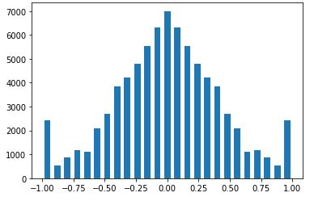
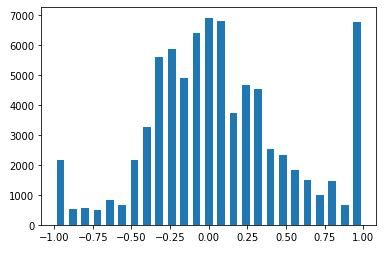

# Pause in online games #
## Demo ##
### Driving on the Highway ###

### Driving in the City ###

Note: This AI is trained for GTA 5 online multiplayer driving , further dvelopment of this project will include a complete AI that can learn your gaming style and take over the wheel for you while you're gone.
## About ##
Your parents ever asked you to pause an online game in order to complete some chores? Well , same but this time you won't get kicked out of the server due to inactivity or get yelled at by your friends cause the cops caught up with you in the game. 
The custom dataset is generated by driving the car from a first-person perspective view, which allowed the data to be trained on actual vehicle vision. This is done by turning on the hood camera in GTA-5. 
The goal of this project is to build a self-driving car with deep learning and computer vision, which can navigate in different environments. The project is inspired by the work done by Sentdex. After experimenting with different convolutional neural networks, NVIDIA's PilotNet is chosen due to its faster prediction rate. YOLOv3, one of the most popular object detection algorithm, is also integrated with PilotNet to add steering, throttle, and brake control as per traffic density.

## Setup and Requirements ##
1. Grand Theft Auto-5 (turn on hood camera)
2. Python 3.6
3. Tensorflow
4. Keras
5. OpenCV
6. Numpy
7. Pygame
8. Xbox 360 Emulator(https://www.x360ce.com/)
9. vJoy (http://vjoystick.sourceforge.net/site/)

## Dataset ##
### My Dataset ###
100,000 images with respective steering angle and throttle is collected by driving the car on the highway. However, only 39,046 images are left after balancing the data, therefore the dataset is artificially expanded by flipping the image along the horizontal axis, and multiplying the steering angle by -1. 
#### Steering ####

#### Throttle ####

## Usage ## 
1. Download and add Xbox 360 Emulator where GTA is installed
2. Install vJoy
3. Set vJoy in Xbox 360 Emulator
4. Download or clone this repo
5. Run test_model_steer.py
## Future Improvements ##
1. Collect diverse dataset
2. Increase resolution of the images in the dataset
3. Use CNN+LSTM to train the model
4. Include shooting and running
5. Create custom datasets for different users while they play.